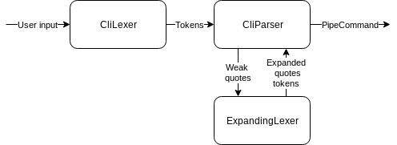

# Диаграмма потока данных

# Диаграмма наследования

Программа разделена на 3 основные компоненты: лексер пользовательского ввода, парсер и команды, в которых содержится сама логика их исполнения. Каждая команда наследуется от класса `PipeCommand`.  
Пользовательский ввод за один проход анализируется лексером, после чего результат передается парсеру. Затем по ходу работы парсера участки, на которых возможно появление подстановки переменных, дополнительно обрабатываются еще одним лексером.

# Отличия от bash
1. Команды в pipeline не выполняются параллельно.
2. `exit` в составе pipeline перестает быть бессмысленной командой и завершает приложение.
3. Неимевшие смысла присваивания внутри pipeline запрещены. Вместо этого присваивания, вынесенные до pipeline, считаются валидными и имеют свой эффект.
4. Многострочные команды не поддерживаются.

# Выбор библиотеки для работы с аргументами
Рассматривались следующие варианты:  
1. picocli
2. JCommander
3. jsap

Выбор пал на picocli по следующим причинам:
1. Подробная документация с примерами 
2. Лаконичность, выразительность и простота в использовании 
3. Код получается легко изменяемым, а используемые для его написания аннотации легко могут служить документацией
4. Бесплатный usage message и поддержка разных цветов в качестве приятного бонуса
